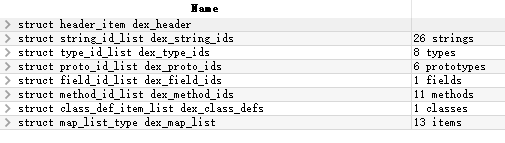
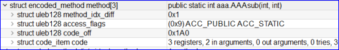

---
#   **Dex结构解析**
---

> # 1 .dex文件整体结构
---
> .dex含有如下结构：
>
> >  DexHeader
> >  StringIds
> >  TypeIds
> >  ProtoIds
> > 	FieldIds
> >  MethodIds
> >  Classdef
> > 	Map_list

---
> 这些结构由DexHeader的off和size去寻址，整体预览
  

---

> # 2.DexHeader详解

* * *

| 字段名称          | 偏移量  | 长度(byte) | 字段描述                                            |
| ------------- | ---- | -------- | ----------------------------------------------- |
| magic         | 0x0  | 0x8      | dex魔术字,固定信息:dex\\n035                           |
| checksum      | 0x8  | 0x4      | alder32算法,去除了magic和checksum字段之外的所有内容的校验码        |
| signature     | 0xc  | 0x14     | sha-1签名,去除了magic,checksum和signature字段之外的所有内容的签名 |
| fileSize      | 0x20 | 0x4      | 整个dex的文件大小                                      |
| headerSize    | 0x24 | 0x4      | 整个dex文件头的大小(固定大小为0x70)                          |
| endianTag     | 0x28 | 0x4      | 字节序(大尾方式.小尾方式)默认为小尾式&lt;0x12345678>             |
| linkSize      | 0x2c | 0x4      | 链接段的大小,默认为0表示静态链接                               |
| linkOff       | 0x30 | 0x4      | 链接段开始偏移                                         |
| mapOff        | 0x34 | 0x4      | map_item偏移                                      |
| stringIdsSize | 0x38 | 0x4      | 字符串列表中的字符串个数                                    |
| stringIdsOff  | 0x3c | 0x4      | 字符串列表偏移                                         |
| typeIdsSize   | 0x40 | 0x4      | 类型列表中的类型个数                                      |
| typeIdsOff    | 0x44 | 0x4      | 类型列表偏移                                          |
| protoIdsSize  | 0x48 | 0x4      | 方法声明列表中的个数                                      |
| protoIdsOff   | 0x4c | 0x4      | 方法声明列表偏移                                        |
| fieldIdsSize  | 0x50 | 0x4      | 字段列表中的个数                                        |
| fieldIdsOff   | 0x54 | 0x4      | 字段列表偏移                                          |
| methodIdsSize | 0x58 | 0x4      | 方法列表中的个数                                        |
| methodIdsOff  | 0x5c | 0x4      | 方法列表偏移                                          |
| classDefsSize | 0x60 | 0x4      | 类定义列表中的个数                                       |
| classDefsOff  | 0x64 | 0x4      | 类定义列表偏移                                         |
| dataSize      | 0x68 | 0x4      | 数据段的大小,4字节对齐                                    |
| dataOff       | 0x6c | 0x4      | 数据段偏移                                           |

* * *

># 3.Classdef 结构
---
> ## Class_data_item 结构由dex_baseAddr+class_data_off
>
> 

* * *

> # 4.Class_data_item结构

* * *

* * *

> # 5.Method 结构

* * *

>  
* * *
># 6. CodeItem结构

* * *

> ## **insns为dex执行的dalvik解释指令单元，即为加固产品常用于加固的字段**
>
> 

* * *

#### 注解：

> > >  以上信息均刻有010编辑器dex模板查看
> > >  对于加固应用，可从classdef ,method,Codeitem等结构入手进行拆解，在执行时能够让应用执行成功
> > >  dex加载的过程会有多个校验过程，加固抽取代码或类结构体保证能dalvik校验成功
