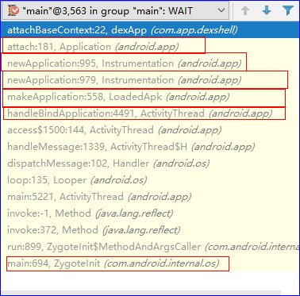

****
#   **Android加载应用apk**

***

##  ANdroid APP的启动

-    1.Android启动一个app, 由zygote创建一个新进程，解读app包信息，在ActivityThread.java中创建Context，加载app的classes.dex.
-   2.在ActivityThread的函数handleBindApplication完成对application的加载
    > > 定义subApplication函数，多用于实现app的检测，加固应用的解壳加载
-   3.在ActivityThread的函数performLaunchActivity实现对Activity的加载

* * *

> 加载Application
>
>  
>---

* * *

> @handleBindApplication函数的解析

    private void handleBindApplication(AppBindData data) {
      //appContext的创建
      final ContextImpl appContext = ContextImpl.createAppContext(this, data.info);
      ... ...
      //android应用调试的端口设置为8100
      Debug.changeDebugPort(8100);
      ... ...
      try {
        // If the app is being launched for full backup or restore, bring it up in
        // a restricted environment with the base application class.
        Application app = data.info.makeApplication(data.restrictedBackupMode, null);
        mInitialApplication = app;
        }catch (Exception e) {}
          try {
       //callApplicationOnCreate即开发者常使用的OnCreate()函数
        mInstrumentation.callApplicationOnCreate(app);
        } catch (Exception e) {}
          ... ...
        }
        类android.app.LoadedApk:
      public Application makeApplication(boolean forceDefaultAppClass,
            Instrumentation instrumentation) {
              //如果mApplication==null，进入下面创建开发者自定义的userApplication

              Application app = null;
              //AndroidManifest.xml中开发者定义的application name=”xxx.xx”
              String appClass = mApplicationInfo.className;
              if (forceDefaultAppClass || (appClass == null)) {
                appClass = "android.app.Application";
              }

              try {
                java.lang.ClassLoader cl = getClassLoader();
                if (!mPackageName.equals("android")) {
                  initializeJavaContextClassLoader();
                }
                ContextImpl appContext = ContextImpl.createAppContext(mActivityThread, this);
                app = mActivityThread.mInstrumentation.newApplication(
                  cl, appClass, appContext);
                  appContext.setOuterContext(app);
              } catch (Exception e) {
                      if (!mActivityThread.mInstrumentation.onException(app, e)) {
                        throw new RuntimeException(
                          "Unable to instantiate application " + appClass
                          + ": " + e.toString(), e);
                        }
              }
                  mActivityThread.mAllApplications.add(app);
                    mApplication = app;
                    if (instrumentation != null) {
                    try {
                     instrumentation.callApplicationOnCreate(app);
                      } catch (Exception e) {
                            if (!instrumentation.onException(app, e)) {
                              throw new RuntimeException(
                                "Unable to create application " + app.getClass().getName()
                                + ": " + e.toString(), e);
                              }
                            }
                          }
                          ...
                  return app;
                }

* * *

* * *

> @performLaunchActivity函数的解析

    ActivityInfo aInfo = r.activityInfo;
    //即启动了MainActivity

       ComponentName component = r.intent.getComponent();
       if (component == null) {
           component = r.intent.resolveActivity(
               mInitialApplication.getPackageManager());
           r.intent.setComponent(component);
       }

       if (r.activityInfo.targetActivity != null) {
           component = new ComponentName(r.activityInfo.packageName,
                   r.activityInfo.targetActivity);
       }

       Activity activity = null;
       try {
           java.lang.ClassLoader cl = r.packageInfo.getClassLoader();
           activity = mInstrumentation.newActivity(
                   cl, component.getClassName(), r.intent);
                       r.state.setClassLoader(cl);
             } catch (Exception e) {  }

       try {
           Application app = r.packageInfo.makeApplication(false, mInstrumentation);

                         activity.attach(appContext, this, getInstrumentation(), r.token,
                       r.ident, app, r.intent, r.activityInfo, title, r.parent,
                       r.embeddedID, r.lastNonConfigurationInstances, config,
                       r.referrer, r.voiceInteractor);

               if (customIntent != null) {
                   activity.mIntent = customIntent;
               }
               if (r.isPersistable()) {
                   mInstrumentation.callActivityOnCreate(activity, r.state, r.persistentState);
               } else {
                   mInstrumentation.callActivityOnCreate(activity, r.state);
               }

    }

* * *

> - 更详细的底层实现解析:
>
> >  [**Dalvik虚拟机的启动过程分析**](https://blog.csdn.net/luoshengyang/article/details/8885792)
>
---
